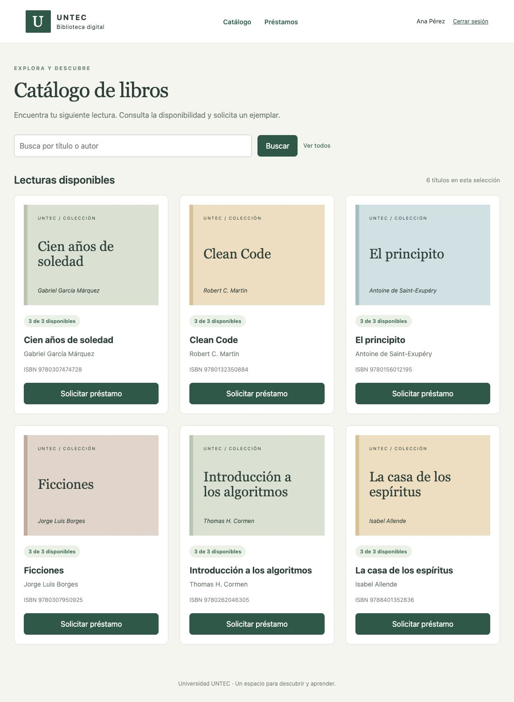

# Biblioteca Digital UNTEC

Aplicación del Proyecto Módulo 5 ABP.



## Descargas de la entrega

La [versión v1.0.0](https://github.com/alopezerices/biblioteca-digital-untec/releases/tag/v1.0.0) incluye el paquete final con documentación Word, el WAR listo para Tomcat y el proyecto Eclipse en ZIP.

Repositorio: https://github.com/alopezerices/biblioteca-digital-untec


Proyecto Módulo #5 ABP — Desarrollo de aplicaciones web dinámicas Java.

Aplicación de biblioteca con catálogo, usuarios, préstamos y devoluciones. Implementa Java EE, JSP, JSTL, Servlets, HttpSession, MVC, DAO y JDBC con H2 persistente. La pauta aplicada es «Proyecto Módulo #5 _ ABP.docx», Biblioteca Digital UNTEC, proporcionada como PDF.

## Requisitos y compilación

- Eclipse IDE for Enterprise Java and Web Developers con JDK 11 o superior.
- Apache Tomcat **9**, compatible con `javax.servlet` y Servlet 4.0.
- Java 11 o superior para compilar; ejecución comprobada con JDK 21.0.11 y Tomcat 9.0.121.
- Internet en la primera compilación para descargar Maven y dependencias. No se necesita instalar una base de datos por separado.

Desde la carpeta del proyecto:

```sh
chmod +x mvnw
./mvnw clean package
```

En Windows: `mvnw.cmd clean package`. Se ejecutan las pruebas JUnit y se genera `target/biblioteca.war`. El WAR entregado incluye H2 y JSTL; Tomcat proporciona la API Servlet.

## Abrir como proyecto web en Eclipse

1. Descomprimir el ZIP de código fuente.
2. Abrir Eclipse Enterprise y elegir un workspace.
3. File → Import → General → Existing Projects into Workspace; seleccionar la carpeta que contiene `.project` y finalizar. Alternativa: Maven → Existing Maven Projects, seleccionando `pom.xml`.
4. Maven → Update Project para resolver las dependencias. En Java Build Path seleccionar un JDK instalado compatible con Java 11.
5. Properties → Project Facets: comprobar **Dynamic Web Module 4.0** y **Java 11**. Los metadatos `.project`, `.classpath` y `.settings` están incluidos.
6. Window → Preferences → Server → Runtime Environments → Add → Apache Tomcat v9.0; seleccionar la instalación de Tomcat y el JDK.
7. En Servers, crear Tomcat v9.0 y agregar BibliotecaDigitalUNTEC. Ejecutar Run on Server o desplegar el WAR mediante Manager como se describe abajo.

Se suministra la configuración de Dynamic Web Project con estructura Maven. La compilación y el despliegue se verificaron fuera del IDE; la importación interactiva de Eclipse debe completarse con el runtime instalado en el equipo receptor.

## Desplegar el WAR con Tomcat Manager

1. Instalar Tomcat 9 y configurar un usuario local con rol `manager-gui` en `conf/tomcat-users.xml`. Elegir una contraseña propia. Reiniciar Tomcat después de cambiar esta configuración.
2. Iniciar `bin/startup.sh` (Windows: `bin/startup.bat`).
3. Abrir `http://localhost:8080/manager/html` e iniciar sesión con ese usuario.
4. En **WAR file to deploy**, seleccionar `biblioteca.war` y pulsar **Deploy**.
5. En la lista de aplicaciones, abrir **/biblioteca**. URL: `http://localhost:8080/biblioteca/`.
6. Para detener el servidor, usar `bin/shutdown.sh` o `bin/shutdown.bat`.

La verificación adjunta usó el puerto **8086** para evitar conflictos: `http://127.0.0.1:8086/biblioteca/`. El archivo `evidencias/tomcat-manager.txt` acredita el contexto en estado `running`, después de desplegar mediante la API de Manager. El puerto depende del Connector de `conf/server.xml`.

## Cuentas de demostración

| Perfil | Correo | Contraseña |
|---|---|---|
| Administrador | admin@untec.test | Biblioteca2026! |
| Estudiante | ana@untec.test | Lectura2026! |
| Estudiante | diego@untec.test | Lectura2026! |

Son datos ficticios educativos. Las cuentas y seis libros se crean solo cuando la base está vacía. Las contraseñas se almacenan como hashes PBKDF2 con sal individual.

## Recorrido de uso

1. Iniciar sesión como Ana, buscar un título o autor y pulsar **Solicitar préstamo**.
2. Revisar **Préstamos**: fecha de solicitud, vencimiento a 14 días y estado.
3. Pulsar **Registrar devolución**. Se libera el ejemplar y se conserva el historial.
4. Cerrar sesión y entrar como administrador.
5. En **Catálogo**, agregar libros; abrir **Editar libro** para modificarlos o confirmar su eliminación.
6. En **Usuarios**, registrar una cuenta de estudiante y consultar las existentes.
7. En **Préstamos**, registrar a nombre de un usuario, renovar un préstamo activo, devolverlo o eliminar un registro ya devuelto.

No se permite prestar sin ejemplares, duplicar un préstamo activo del mismo libro al mismo usuario, reducir stock bajo los préstamos activos ni borrar libros con historial relacionado. Para eliminar un libro con historial, devolver sus préstamos y eliminar primero esos registros desde administración. Los estudiantes solo ven y devuelven sus propios préstamos; las modificaciones administrativas se validan en el servidor.

## Datos y estructura

H2 almacena sus datos en `CATALINA_BASE/data/untec.mv.db`, fuera del WAR. Redesplegar el WAR conserva los datos. No se inicia una consola de base de datos ni un servidor H2 de red. Para usar otra ubicación, definir la propiedad JVM `biblioteca.db.url` con una URL JDBC H2 válida; `biblioteca.db.password` permite configurar su contraseña. Para reiniciar la demostración, detener Tomcat, respaldar y retirar la base de esa ubicación; el siguiente arranque recrea los datos iniciales.

- `model`: entidades Libro, Usuario y Prestamo.
- `controller`: Servlets GET/POST y filtro de seguridad.
- `view`: rutas de vistas; JSP en `src/main/webapp/WEB-INF/view`.
- `dao`: consultas y transacciones JDBC.
- `config`: Singleton Database e inicialización.
- `service`: protección de contraseñas.
- `src/main/resources/schema.sql`: tablas, restricciones e índices.
- `src/main/webapp/WEB-INF/web.xml`: rutas, sesión, filtros y errores.
- `src/test/java`: pruebas de integración con H2 en memoria.

## Validación y portafolio

Consultar `docs/VALIDACION.docx` para la correspondencia con las seis lecciones, `docs/PORTAFOLIO.docx` para arquitectura y aprendizajes, y `docs/MVC.svg` para el diagrama. `evidencias/` contiene seis capturas reales, resultado de pruebas y estado de Manager. El proyecto es una demostración académica local; no incorpora correo, recuperación de contraseñas ni multas porque no son exigidos en la pauta.
